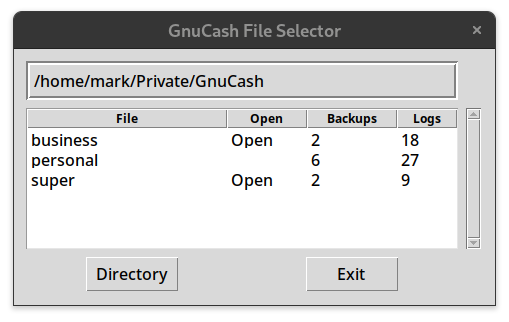

## GNUCASH-SELECT
[](https://aur.archlinux.org/packages/gnucash-select/)

[gnucash-select][REPO] is a simple desktop utility which you can run
from your desktop environment (GNOME, KDE etc) to pop up a small GUI to
view a list of your [GnuCash][GNUC] files (XML format only).



[gnucash-select][REPO] is useful if you have more than one GnuCash file,
particularly if you often open two or more of them in parallel. It
iterates through your [GnuCash][GNUC] directory and filters out your
main financial files from within the many other backup, log, and other
files which [unfortunately GnuCash also places in that same
directory](https://bugs.gnucash.org/show_bug.cgi?id=619119). Alongside
each [GnuCash][GNUC] file, a count of the number of associated backup
and log files is shown and also an indicator of whether that file is
currently open in [GnuCash][GNUC] or not. If the file is not currently
open, you can click on the file name in the GUI to open it in
[GnuCash][GNUC].

This utility was created on a Linux desktop. I am not sure how well it
works on Windows/Mac, raise an issue here if necessary. The latest
version and documentation is available at
https://github.com/bulletmark/gnucash-select.

If you like this utility then you may be interested in another gnucash
utility I created to [update quote prices from the
ASX](https://github.com/bulletmark/gnucash-asx-fetch), without using Finance::Quote.

## INSTALLATION

NOTE: Arch users can just install [_gnucash-select from the
AUR_][AUR].

You need Python 3.8 or later, Python 2 is not supported.

Install this software:

    git clone https://github.com/bulletmark/gnucash-select.git
    cd gnucash-select
    sudo make install (or sudo ./gnucash-select-setup install)

## UPGRADE

    # cd to source dir, as above
    git pull
    sudo make install (or sudo ./gnucash-select-setup install)

## REMOVAL

    # cd to source dir, as above
    sudo make uninstall (or sudo ./gnucash-select-setup uninstall)

## USAGE

Type `gnucash-select -h` to view the usage summary:

```
usage: gnucash-select [-h] [-p PERIOD] [-r ROWS] [-g GTK_THEME]
                      [-P GNUCASH_PROGRAM] [-f FONT_SIZE]

GnuCash File Selector

options:
  -h, --help            show this help message and exit
  -p PERIOD, --period PERIOD
                        period in seconds at which to check directory, default
                        = 2
  -r ROWS, --rows ROWS  number of file rows displayed in table, default = 6
  -g GTK_THEME, --gtk-theme GTK_THEME
                        GTK theme to use running gnucash, e.g. "Adwaita:light"
  -P GNUCASH_PROGRAM, --gnucash-program GNUCASH_PROGRAM
                        path to GnuCash program, default is "gnucash"
  -f FONT_SIZE, --font-size FONT_SIZE
                        default font size, default=10

Note you can set default starting options in $HOME/.config/gnucash-
select.conf.
```

## LICENSE

Copyright (C) 2020 Mark Blakeney. This program is distributed under the
terms of the GNU General Public License.
This program is free software: you can redistribute it and/or modify it
under the terms of the GNU General Public License as published by the
Free Software Foundation, either version 3 of the License, or any later
version.
This program is distributed in the hope that it will be useful, but
WITHOUT ANY WARRANTY; without even the implied warranty of
MERCHANTABILITY or FITNESS FOR A PARTICULAR PURPOSE. See the GNU General
Public License at <https://www.gnu.org/licenses/> for more details.

Desktop icon courtesy of [Freepik](https://www.flaticon.com/authors/freepik).

[REPO]: https://github.com/bulletmark/gnucash-select/
[AUR]: https://aur.archlinux.org/packages/gnucash-select/
[GNUC]: https://www.gnucash.org/

<!-- vim: se ai syn=markdown: -->
